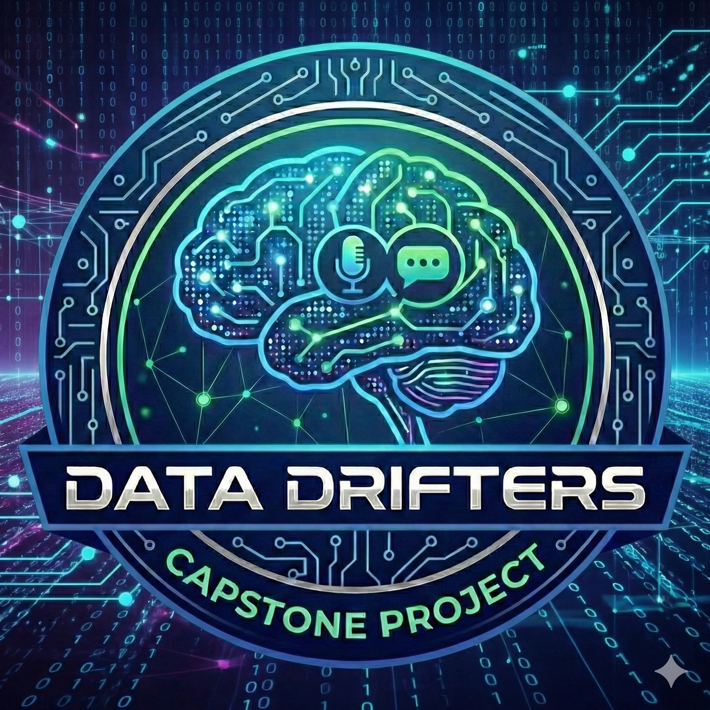

# 📖 User Guide: AI Interview Coach

Welcome to the **AI Interview Coach**! This guide will help you get the application running on your computer with just a few clicks. Our system is designed to be "Zero-Config," meaning the setup scripts handle the technical details for you.

---

## 🚀 One-Click Startup (Recommended)

This is the fastest way to get started. The startup scripts will automatically check for Python, download audio drivers (FFmpeg), and configure your AI engine.

### 1. Download & Launch
1.  **Download & Extract** the project folder to a location on your computer.
2.  **Windows Users**: Double-click the **`start.bat`** file.
    *   *Note: If Python is missing, the script will ask to install it for you using Windows Winget.*
3.  **Mac/Linux Users**: Open a terminal in the folder and run **`bash start.sh`**.

### 2. What the Script Does Automatically
*   **Auto-Python**: Detects Python 3.11–3.13. If none is found, it installs Python 3.12 for you (Windows: via `winget`; Mac: via Homebrew; Linux: via your package manager).
*   **Auto-Ollama**: Detects if [Ollama](https://ollama.com/) is installed. If not, it will ask whether to install it for you before proceeding.
*   **Portable Audio**: Downloads a portable version of **FFmpeg** so you don't have to configure system variables.
*   **Smart AI Engine**: Detects if you have an NVIDIA GPU or an Apple M-Series chip and installs the high-performance version of the AI "brain."
*   **Virtual Environment**: Creates a private space for the app so it doesn't affect your other programs.

---

## 🎯 How to Use the Coach

### Step 1: Configuration
*   **Coach Voice**: Choose between **Male** or **Female** in the sidebar.
*   **Compute Allocation**: Check the **"💡 Hardware Helper"** in the sidebar. It will tell you whether to select **NVIDIA GPU**, **Apple Silicon**, or **CPU** based on your detected hardware.
*   **Inference Provider**: 
    *   Select **Local (Ollama)** for 100% private sessions (Requires [Ollama](https://ollama.com/) to be running).
    *   Select **External API** (OpenAI, Gemini, or Claude) for cloud-based coaching (Requires an API Key).
*   **API Keys (Optional Shortcut)**: If you use an external provider regularly, add your key to the `.env` file (see `.env.example` for the variable names). The app will load it automatically — no need to paste it in every session.

### Step 2: Setup your Interview
1.  Enter your **Industry**, **Job Title**, and **Seniority**.
2.  **Contextual Data (Optional)**: Upload your **Resume** or a **Job Description**. The AI will scan these to ask highly personalized questions about your actual background.
3.  Click **Generate Interview Rounds** to see your tailored path.
4.  Select a **Round** and an **Interviewer Style**. Six styles are available — each behaves very differently:

    | Style | Best For |
    |---|---|
    | 🤝 Friendly HR | Screening rounds, career motivation, culture questions |
    | 🔬 Strict Tech Lead | Technical depth, system design, architecture trade-offs |
    | 🎯 Behavioral Coach | STAR-format answers, competency and situational rounds |
    | 🌱 Culture Fit | Values, team dynamics, collaboration and work style |
    | 🔥 Stress Interviewer | High-pressure tolerance, composure under challenge |
    | 🏛️ Executive Sponsor | Final rounds, strategy, leadership and vision questions |

### Step 3: The Interview
1.  The Coach will greet you personally and ask the first question.
2.  Click **Record** to speak, and **Stop** when finished.
3.  Click **Submit Answer** to send it to the coach.
4.  Need to hear it again? Click the **🔊 Replay** button directly under the AI's message.

### Step 4: Performance Review
*   Click **End Interview & Analyze** to see your results.
*   Check your **Acoustic Metrics**: See your pacing (WPM) and filler word usage.
*   **Export**: Download a professional PDF report of your entire session.

---

## 🔐 Privacy & Safety
*   **Local Storage**: All recordings and transcripts stay on your machine in the `temp_data` folder.
*   **Instant Wipe**: Use the **"Delete All Data"** button in the "Danger Zone" to permanently erase everything.
